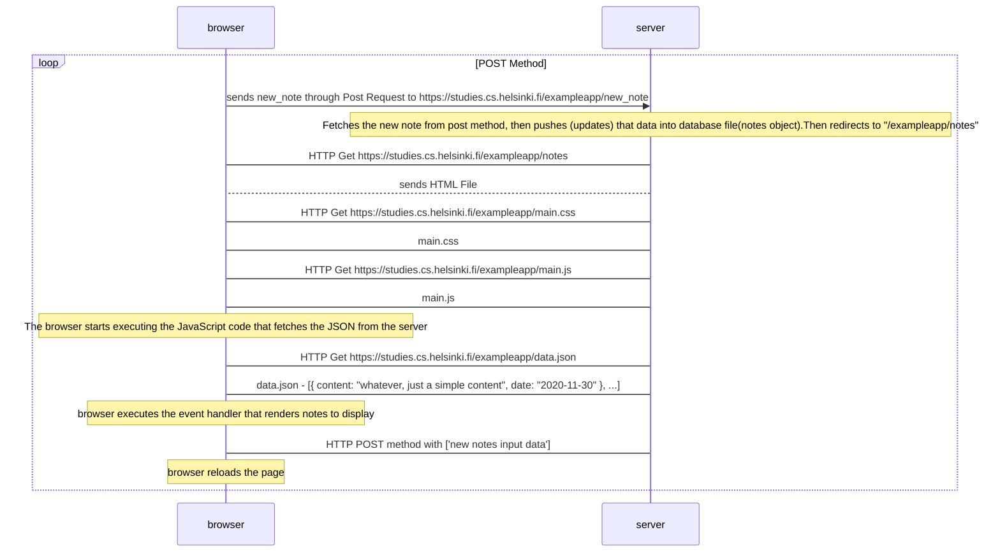

```mermaid
sequenceDiagram
    participant b as  browser
    participant s as server
loop POST Method

    b ->> s: sends new_note through Post Request to https://studies.cs.helsinki.fi/exampleapp/new_note
    Note over s: Fetches the new note from post method, then pushes (updates) that data into database file(notes object).Then redirects to "/exampleapp/notes"

    b -> s: HTTP Get https://studies.cs.helsinki.fi/exampleapp/notes
    s --> b: sends HTML File
    b-> s : HTTP Get https://studies.cs.helsinki.fi/exampleapp/main.css
    s -> b : main.css
    b-> s : HTTP Get https://studies.cs.helsinki.fi/exampleapp/main.js
    s -> b : main.js
    Note over b: The browser starts executing the JavaScript code that fetches the JSON from the server
    b-> s : HTTP Get https://studies.cs.helsinki.fi/exampleapp/data.json
    s -> b : data.json - [{ content: "whatever, just a simple content", date: "2020-11-30" }, ...]

   Note over b: browser executes the event handler that renders notes to display

   b -> s: HTTP POST method with ['new notes input data']
   note over b: browser reloads the page
end
```
