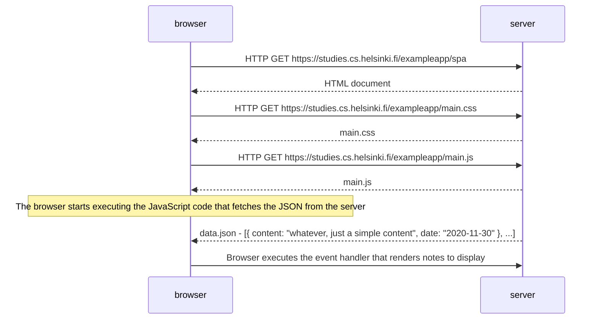

```mermaid
 sequenceDiagram
 participant b as browser
 participant s as server

 b ->> s : HTTP GET https://studies.cs.helsinki.fi/exampleapp/spa
 s -->> b: HTML document
 b ->> s: HTTP GET https://studies.cs.helsinki.fi/exampleapp/main.css
 s -->> b: main.css
 b->> s: HTTP GET https://studies.cs.helsinki.fi/exampleapp/main.js
 s -->> b: main.js
 note over b: The browser starts executing the JavaScript code that fetches the JSON from the server

 s-->> b : data.json - [{ content: "whatever, just a simple content", date: "2020-11-30" }, ...]
 b ->> s: Browser executes the event handler that renders notes to display

```
