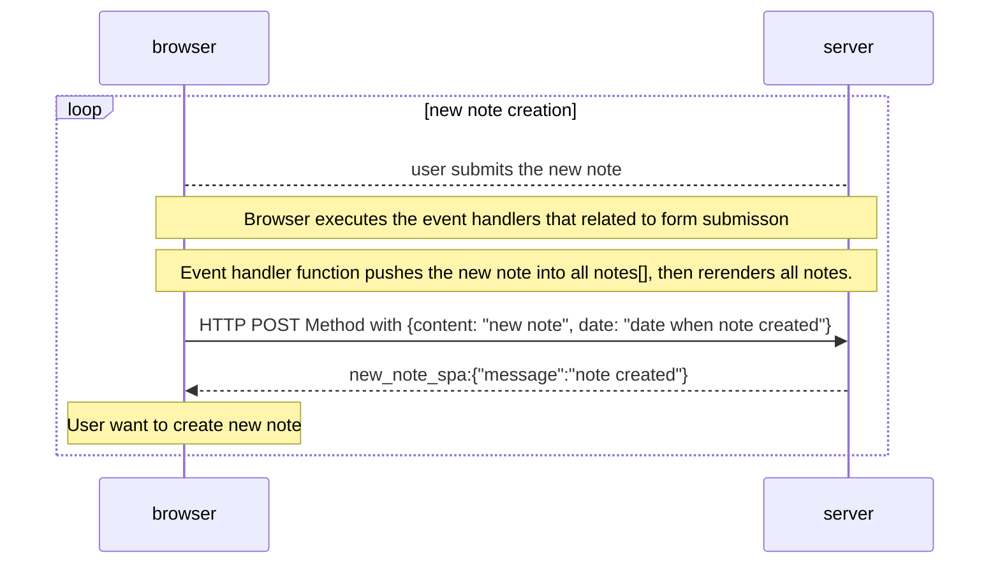

```mermaid
sequenceDiagram
    participant b as browser
    participant s as server
    loop new note creation
        b --> s: user submits the new note
        note over b,s: Browser executes the event handlers that related to form submisson

        note over b,s: Event handler function pushes the new note into all notes[], then rerenders all notes.

        b ->> s : HTTP POST Method with {content: "new note", date: "date when note created"}

        s -->> b: new_note_spa:{"message":"note created"}

        note over b: User want to create new note
    end
```
